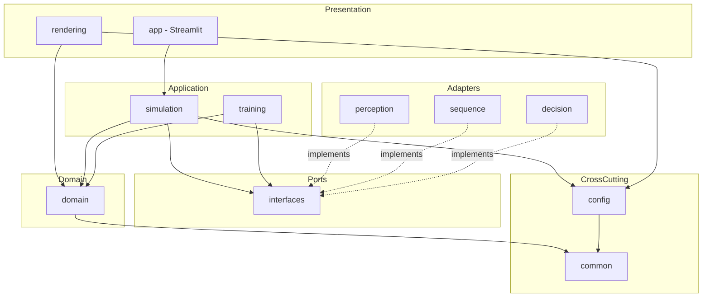
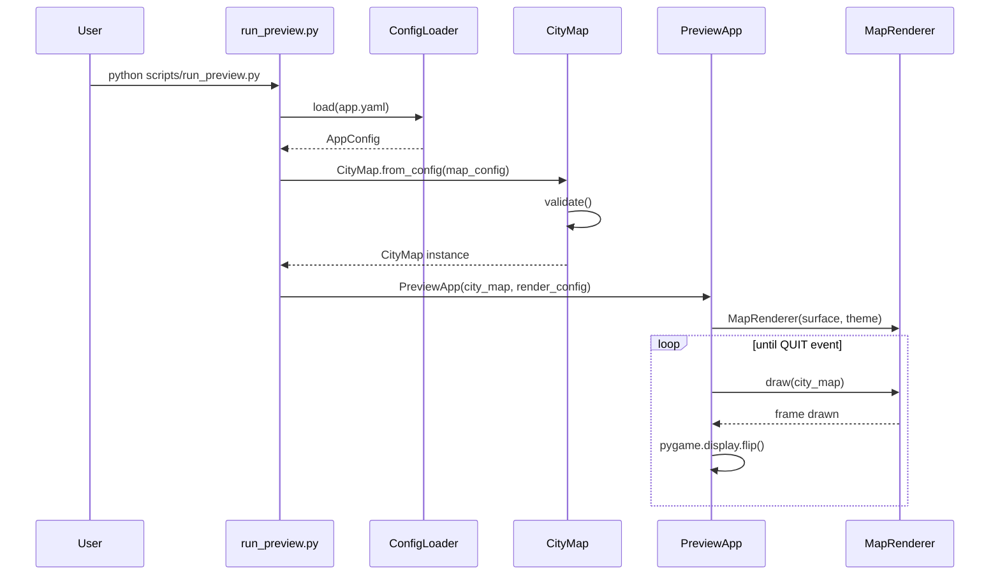
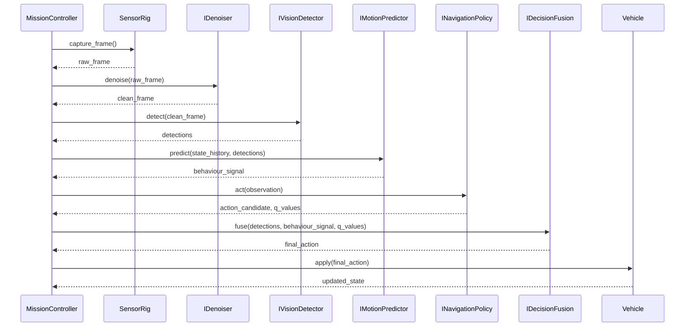
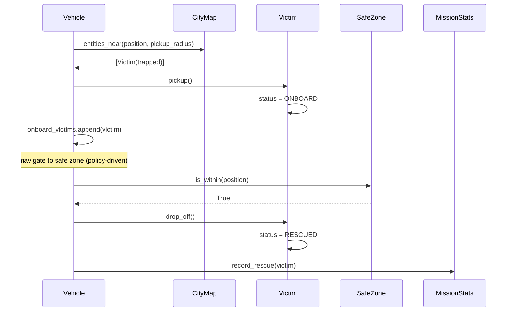

# SENTRY AI — Autonomous Emergency Rescue Vehicle for Disaster Zones

**Type:** Semester-long Applied Deep Learning project (simulation-based)
**Status:** Architecture approved — Phase 1 complete, Phase 2 pending
**Audience:** Single student developer, evaluated to production-software standards

This document is the canonical architecture reference for SENTRY AI. It is intentionally
implementation-agnostic (no code) and describes *what* the system is, *how* its parts
communicate, and *when* each piece gets built. Individual phases may add phase-specific
notes under `docs/`, but this file is the source of truth for structure and contracts.

---

## Table of Contents

1. [Executive Summary](#1-executive-summary)
2. [Architectural Style](#2-architectural-style)
3. [High-Level Component Design](#3-high-level-component-design)
4. [Folder Structure](#4-folder-structure)
5. [Module Responsibilities](#5-module-responsibilities)
6. [Data Flow](#6-data-flow)
7. [UML — Package / Component Diagram](#7-uml--package--component-diagram)
8. [Class Diagrams](#8-class-diagrams)
9. [Sequence Diagrams](#9-sequence-diagrams)
10. [Development Roadmap & Phase Breakdown](#10-development-roadmap--phase-breakdown)
11. [Milestones](#11-milestones)
12. [API Contracts Between Modules](#12-api-contracts-between-modules)
13. [Configuration Files](#13-configuration-files)
14. [Training Pipeline](#14-training-pipeline)
15. [Deployment Pipeline](#15-deployment-pipeline)
16. [Testing Strategy](#16-testing-strategy)
17. [Documentation Structure](#17-documentation-structure)
18. [Future Improvements](#18-future-improvements)

---

## 1. Executive Summary

SENTRY AI is a simulated autonomous rescue vehicle that operates in a top-down disaster
city. It perceives its environment through a simulated camera, cleans that signal,
detects victims/fire/obstacles, predicts short-term motion behaviour, chooses navigation
actions via a learned policy, fuses all signals into a final decision, and acts —
rescuing victims and returning them to a safe zone before its battery or the mission
timer runs out.

Every syllabus unit maps to exactly one concrete, load-bearing module — not a bolted-on
demo:

| Unit | Concept | Role in the system |
|---|---|---|
| I | PyTorch MLP, Adam, ReLU, Dropout | Final decision-fusion network combining perception, sequence, and policy signals into an action/priority score |
| II | YOLOv8n, transfer learning | Detects victims, fire, obstacles in camera frames |
| III | LSTM | Predicts near-term vehicle motion / navigation behaviour class from state history |
| IV | Denoising Autoencoder | Cleans noisy/occluded camera frames before detection |
| V | Deep Q-Network (SB3) | Learns the autonomous navigation policy inside a Gymnasium environment |

The system is built as a **walking skeleton first**: every phase produces a runnable,
tested increment. AI modules are introduced behind stable interfaces so the simulation
and rendering layers never depend on a specific model implementation — a fresh
`DQNPolicy` can replace a scripted policy without touching simulation code.

---

## 2. Architectural Style

**Clean Architecture / Ports & Adapters (Hexagonal)**, with a thin vertical AI-pipeline
running through it.

```
┌─────────────────────────────────────────────────────────────┐
│  Presentation  (rendering/, app/ — Pygame HUD, Streamlit)    │
├─────────────────────────────────────────────────────────────┤
│  Application   (simulation/, training/ — orchestration,      │
│                 mission control, RL environment)             │
├─────────────────────────────────────────────────────────────┤
│  Domain        (domain/ — entities, map, rules; zero deps    │
│                 on frameworks, pure Python + dataclasses)    │
├─────────────────────────────────────────────────────────────┤
│  Ports         (interfaces/ — abstract contracts: vision,    │
│                 denoiser, sequence predictor, policy, fusion)│
├─────────────────────────────────────────────────────────────┤
│  Adapters      (perception/, sequence/, decision/ — concrete │
│                 PyTorch / YOLO / SB3 implementations of ports)│
└─────────────────────────────────────────────────────────────┘
```

Rules enforced project-wide:

- **Dependency rule**: dependencies point inward. `domain/` imports nothing from
  `simulation/`, `rendering/`, or any AI package. AI adapters depend on `interfaces/`
  and `domain/`, never the reverse.
- **Dependency inversion**: `simulation/` depends on `interfaces.IVisionDetector` etc.,
  not on `perception.YoloDetector`. Concrete adapters are wired in at composition roots
  (`scripts/*.py`, `app/`) via constructor injection — never imported ad hoc deep inside
  business logic.
- **Config-driven, no magic numbers**: every tunable (grid size, battery drain rate,
  reward weights, model hyperparameters) lives in `configs/*.yaml`, loaded into typed
  dataclasses.
- **Composition over inheritance**: entities and services favor small composed
  dataclasses/protocols over deep class hierarchies.

---

## 3. High-Level Component Design

```
                        ┌────────────────────┐
                        │   Streamlit App     │  (Phase 9)
                        │  mission dashboard   │
                        └─────────┬───────────┘
                                  │ reads mission logs / replay
┌─────────────────────────────────────────────────────────────────┐
│                        Simulation Engine (Phase 2)                │
│  ┌───────────┐  ┌────────────┐  ┌───────────────┐  ┌──────────┐  │
│  │ CityMap   │  │ MissionCtl │  │ SensorRig       │  │ Renderer │  │
│  │ (domain)  │  │ (state mgr)│  │ (frame capture) │  │ (pygame) │  │
│  └───────────┘  └─────┬──────┘  └───────┬────────┘  └──────────┘  │
└────────────────────────┼────────────────┼──────────────────────────┘
                          │                │ raw frame
                          │                ▼
                          │      ┌───────────────────┐
                          │      │ IDenoiser (Ph.4)   │
                          │      └─────────┬──────────┘
                          │                │ clean frame
                          │                ▼
                          │      ┌───────────────────┐
                          │      │ IVisionDetector    │ (Ph.3)
                          │      │ (YOLOv8n)          │
                          │      └─────────┬──────────┘
                          │                │ detections
                          │                ▼
                          │      ┌───────────────────┐
                          │      │ IMotionPredictor   │ (Ph.5)
                          │      │ (LSTM)             │
                          │      └─────────┬──────────┘
                          │                │ behaviour signal
                          │                ▼
                          │      ┌───────────────────┐
                          │      │ INavigationPolicy  │ (Ph.6)
                          │      │ (DQN via SB3)       │
                          │      └─────────┬──────────┘
                          │                │ candidate action / Q-values
                          │                ▼
                          │      ┌───────────────────┐
                          └─────▶│ IDecisionFusion     │ (Ph.7)
                                 │ (MLP)                │
                                 └─────────┬────────────┘
                                           │ final action
                                           ▼
                                 ┌───────────────────┐
                                 │ Vehicle Actuation   │
                                 │ (simulation/)       │
                                 └───────────────────┘
```

Everything below the `IDenoiser → … → IDecisionFusion` chain is defined as a **port**
in Phase 1 and remains an interface (unimplemented adapter) until its dedicated phase.
The simulation engine can always run — with a scripted/manual policy standing in for
the learned one — because it only ever talks to the interface.

---

## 4. Folder Structure

```
sentry/
├── PROJECT.md                     # this document
├── CLAUDE.md                      # working rules for AI-assisted development
├── README.md                      # quick start
├── pyproject.toml                 # packaging + tool config (pytest/mypy/ruff)
├── requirements.txt                # pinned core dependencies
├── requirements-ml.txt             # heavy ML deps, installed from Phase 3 onward
├── .gitignore
│
├── configs/                        # all tunables — nothing hardcoded in code
│   ├── app.yaml                    # root config: composes the others
│   ├── logging.yaml                # dictConfig-style logging setup
│   ├── simulation.yaml             # tick rate, battery/timer rules (Phase 2+)
│   ├── vehicle.yaml                # vehicle kinematics/limits (Phase 2+)
│   ├── render.yaml                 # window size, palette, tile size
│   ├── maps/
│   │   └── city_default.yaml       # disaster city map definition
│   └── training/                   # per-model hyperparameters (Phase 3-7)
│       ├── yolo.yaml
│       ├── autoencoder.yaml
│       ├── lstm.yaml
│       ├── dqn.yaml
│       └── mlp_fusion.yaml
│
├── src/
│   └── sentry_ai/
│       ├── __init__.py
│       ├── common/                 # cross-cutting, framework-free
│       │   ├── logging_config.py
│       │   ├── exceptions.py
│       │   └── types.py
│       ├── config/                 # typed config schema + loader
│       │   ├── schema.py
│       │   └── loader.py
│       ├── domain/                 # pure business entities & rules
│       │   ├── enums.py
│       │   ├── entities.py
│       │   └── map.py
│       ├── interfaces/             # ports — ABCs implemented by AI adapters
│       │   ├── perception.py       # IVisionDetector, IDenoiser
│       │   ├── sequence.py         # IMotionPredictor
│       │   └── decision.py         # INavigationPolicy, IDecisionFusion
│       ├── rendering/              # Pygame presentation layer
│       │   ├── theme.py
│       │   ├── map_renderer.py
│       │   ├── hud.py              # Phase 2
│       │   └── app.py
│       ├── simulation/             # Phase 2 — engine, mission, sensors, physics
│       ├── perception/             # Phase 3/4 — YOLO + autoencoder adapters
│       ├── sequence/                # Phase 5 — LSTM adapter
│       ├── decision/                 # Phase 6/7 — DQN policy + MLP fusion adapters
│       ├── training/                  # Phase 3-7 — training pipeline orchestration
│       └── app/                        # Phase 9 — Streamlit dashboard
│
├── scripts/                        # composition roots / CLI entry points
│   ├── run_preview.py              # Phase 1: render static city map
│   ├── run_simulation.py           # Phase 2
│   ├── train_yolo.py               # Phase 3
│   ├── train_autoencoder.py        # Phase 4
│   ├── train_lstm.py               # Phase 5
│   ├── train_dqn.py                # Phase 6
│   ├── train_mlp_fusion.py         # Phase 7
│   └── run_app.py                  # Phase 9
│
├── data/
│   ├── raw/
│   ├── processed/
│   └── maps/
├── models/                         # trained artifacts (git-ignored, versioned via DVC/hash later)
├── tests/
│   ├── unit/
│   ├── integration/
│   └── e2e/
├── docs/
│   ├── architecture/                # phase-specific design notes, ADRs
│   ├── api/
│   └── adr/
└── notebooks/                       # exploratory training notebooks
```

Every package listed but not yet implemented is a **planned location**, not a stub —
it is created with real content only in the phase that owns it, per `CLAUDE.md`'s "no
placeholder code" rule.

---

## 5. Module Responsibilities

| Module | Owns | Must NOT do |
|---|---|---|
| `common/` | Logging setup, exception hierarchy, shared type aliases | Import from domain/simulation/AI packages |
| `config/` | Loading & validating YAML into typed dataclasses | Contain business logic |
| `domain/` | Entities (Vehicle, Victim, Fire, Obstacle, Building, SafeZone…), the `CityMap` aggregate, domain enums | Know about Pygame, PyTorch, files on disk |
| `interfaces/` | Abstract contracts (ports) every AI adapter must satisfy | Contain any model logic |
| `rendering/` | Drawing domain state to a Pygame surface, HUD | Mutate domain/simulation state |
| `simulation/` (Ph.2) | Tick loop, mission state machine, vehicle movement, sensor frame capture | Know about specific model classes — only interfaces |
| `perception/` (Ph.3/4) | `YoloDetector`, `ConvDenoisingAutoencoder` adapters implementing the perception ports | Drive the render loop or own domain entities |
| `sequence/` (Ph.5) | `LstmMotionPredictor` adapter | — |
| `decision/` (Ph.6/7) | `DqnPolicy`, `MlpFusion` adapters | — |
| `training/` (Ph.3-7) | Dataset assembly, training loops, checkpointing, metrics logging | Contain inference-time orchestration |
| `app/` (Ph.9) | Streamlit dashboard reading mission logs/replays | Run training or the live sim loop |

---

## 6. Data Flow

**Per simulation tick (from Phase 2 onward), the full autonomous pipeline:**

```
CityMap + Vehicle state
        │
        ▼
SensorRig.capture_frame() ──────────────► raw_frame: np.ndarray (H,W,3)
        │
        ▼
IDenoiser.denoise(raw_frame) ───────────► clean_frame
        │
        ▼
IVisionDetector.detect(clean_frame) ────► Detection[] {label, bbox, confidence}
        │
        ▼
IMotionPredictor.predict(state_history, Detection[]) ─► BehaviourSignal
        │
        ▼
INavigationPolicy.act(observation) ─────► action_candidate, q_values
        │
        ▼
IDecisionFusion.fuse(Detection[], BehaviourSignal, q_values) ─► FinalAction
        │
        ▼
MissionController.apply(FinalAction) ───► updates Vehicle, Victims, Battery, Timer
        │
        ▼
Renderer.draw(CityMap, Vehicle, HUD state) ─► frame on screen
```

**Phase 1 data flow (what exists today)** is the top and bottom of this diagram only:
`ConfigLoader → CityMap → Renderer`, with every AI stage represented solely as an
unfulfilled interface. No frame ever flows through them yet.

---

## 7. UML — Package / Component Diagram



---

## 8. Class Diagrams

### 8.1 Domain entities (Phase 1)


### 8.2 Ports (interfaces — defined Phase 1, implemented in later phases)


---

## 9. Sequence Diagrams

### 9.1 Phase 1 — Static map preview (implemented)



### 9.2 Future — Autonomous mission tick (Phase 8 target, shown for context)



### 9.3 Future — Victim rescue interaction (Phase 2/8 target)



---

## 10. Development Roadmap & Phase Breakdown

| Phase | Title | Weeks | Syllabus Unit(s) | Status |
|---|---|---|---|---|
| 1 | Foundation & Core Architecture | 1-2 | — (infra) | ✅ **Complete** |
| 2 | Simulation Engine & Game Loop | 3-4 | — (infra) | ⏳ Not started |
| 3 | Computer Vision — Detection | 5-6 | Unit II | ⏳ Not started |
| 4 | Representation Learning — Denoising AE | 7 | Unit IV | ⏳ Not started |
| 5 | Sequence Modeling — LSTM | 8 | Unit III | ⏳ Not started |
| 6 | Reinforcement Learning — DQN | 9-11 | Unit V | ⏳ Not started |
| 7 | Decision Fusion — MLP | 12 | Unit I | ⏳ Not started |
| 8 | End-to-End Autonomous Integration | 13 | All | ⏳ Not started |
| 9 | Dashboard, Testing, Docs, Deployment | 14-15 | — | ⏳ Not started |
| 10 | Stretch / Future Improvements | post-semester | — | ⏳ Not started |

### Phase 1 — Foundation & Core Architecture ✅

Scope: everything needed to *compile, render a static disaster city, and pass tests* —
with zero AI, zero movement, zero mission logic. This is the walking skeleton.

Deliverables:
- Repo scaffolding: `pyproject.toml`, `requirements.txt`, `.gitignore`, tool config (pytest/mypy/ruff)
- Structured logging (`common/logging_config.py`, `configs/logging.yaml`)
- Exception hierarchy (`common/exceptions.py`)
- Config system: typed dataclasses + YAML loader with validation (`config/`)
- Domain layer: entities, enums, `CityMap` aggregate with validation (`domain/`)
- Default disaster-city map definition (`configs/maps/city_default.yaml`)
- AI ports defined as ABCs with zero logic (`interfaces/`)
- Static Pygame(-ce) renderer + preview script (`rendering/`, `scripts/run_preview.py`)
- Unit tests for config, domain, map loading (`tests/unit/`)

Explicitly **out of scope** for Phase 1: vehicle movement, battery/timer countdown,
fire spread, sensors, HUD, any PyTorch/YOLO/RL code. These belong to Phases 2-7.

### Phase 2 — Simulation Engine & Game Loop

- Tick-based `SimulationEngine` (fixed timestep), `MissionController` state machine
- Vehicle kinematics (grid or continuous movement — decided in Phase 2 ADR), collision
  against `blocks_movement` terrain/obstacles
- Battery drain model, mission timer, mission-objective tracking
- `SensorRig`: renders the vehicle's local view to an `ndarray` (the "camera frame")
  used by every AI phase from here on
- Fire/smoke spread (simple cellular automaton over `TerrainType`)
- HUD rendering (battery, timer, victims rescued/remaining, vehicle health)
- Manual/keyboard control mode for debugging (stand-in for `INavigationPolicy`)

### Phase 3 — Computer Vision (Unit II)

- Synthetic dataset generator: auto-labeled bounding boxes from ground-truth `CityMap`
  entities rendered via `SensorRig`
- YOLOv8n fine-tuning pipeline (`train_yolo.py`, `configs/training/yolo.yaml`)
- `YoloDetector` adapter implementing `IVisionDetector`, wired into the pipeline

### Phase 4 — Representation Learning (Unit IV)

- Noise-injection augmentation (motion blur, smoke occlusion, sensor grain) applied to
  synthetic frames
- Convolutional Denoising Autoencoder (PyTorch) trained to reconstruct clean frames
- `ConvDenoisingAutoencoder` adapter implementing `IDenoiser`, inserted upstream of the detector

### Phase 5 — Sequence Modeling (Unit III)

- Trajectory dataset collected from Phase 2 scripted/manual runs (state history windows)
- LSTM predicting short-horizon movement / behaviour class
- `LstmMotionPredictor` adapter implementing `IMotionPredictor`

### Phase 6 — Reinforcement Learning (Unit V)

- `SentryEnv`: Gymnasium-compliant wrapper around the Phase 2 simulation engine
- Reward shaping: +rescue, +progress-to-safe-zone, −collision, −fire-proximity, −time,
  −battery-waste (all weights config-driven, `configs/training/dqn.yaml`)
- Stable-Baselines3 DQN training pipeline (`train_dqn.py`); state-based observation first,
  vision-based observation as a stretch goal
- `DqnPolicy` adapter implementing `INavigationPolicy`

### Phase 7 — Decision Fusion (Unit I)

- MLP (PyTorch, Adam optimizer, ReLU activations, Dropout regularization) fusing
  detector confidences + LSTM behaviour signal + DQN Q-values into the vehicle's final
  action/priority decision
- `MlpFusion` adapter implementing `IDecisionFusion`

### Phase 8 — End-to-End Autonomous Integration

- Composition root wires all five adapters into `MissionController`, replacing the
  manual-control stand-in
- Full autonomous mission runs; mission statistics logged
- Profiling against target hardware (RTX laptop GPU, 16GB RAM) — trim batch sizes /
  resolution as needed

### Phase 9 — Dashboard, Testing, Documentation & Deployment

- Streamlit dashboard: live/replay mission viewer, statistics, model registry view
- Full test pyramid, coverage target enforced in CI
- Packaging + deployment pipeline (see §15)
- Final docs, ADRs, demo script

### Phase 10 — Future Improvements (see §18)

---

## 11. Milestones

- [x] **M1 — Walking Skeleton**: `pytest` green, `scripts/run_preview.py` renders the
      default disaster city map end-to-end. *(Phase 1)*
- [ ] **M2 — Living City**: vehicle moves under manual control, battery/timer function,
      fire spreads, HUD renders live stats. *(Phase 2)*
- [ ] **M3 — Sees**: YOLOv8n detects victims/fire/obstacles in simulated camera frames
      above target mAP. *(Phase 3)*
- [ ] **M4 — Sees Clearly**: denoising autoencoder measurably improves detection mAP
      under injected noise. *(Phase 4)*
- [ ] **M5 — Anticipates**: LSTM behaviour predictions beat a naive baseline on held-out
      trajectories. *(Phase 5)*
- [ ] **M6 — Learns to Drive**: DQN agent reaches a defined rescue-rate threshold in
      `SentryEnv` without human control. *(Phase 6)*
- [ ] **M7 — Decides**: MLP fusion outperforms any single upstream signal on a fused
      decision-quality metric. *(Phase 7)*
- [ ] **M8 — Fully Autonomous**: a complete mission (spawn → rescue all reachable
      victims → return to safe zone) runs with zero human input. *(Phase 8)*
- [ ] **M9 — Shippable**: dashboard, docs, and deployment pipeline complete; project
      demoable end-to-end from a clean checkout. *(Phase 9)*

---

## 12. API Contracts Between Modules

Contracts are expressed as Python `Protocol`/`ABC` signatures — the authoritative form
lives in `src/sentry_ai/interfaces/`. Types (`Detection`, `BehaviourSignal`, `Action`,
`FinalAction`) are frozen dataclasses defined alongside the interfaces they serve.

```python
# interfaces/perception.py
class IDenoiser(ABC):
    def denoise(self, frame: NDArray[np.uint8]) -> NDArray[np.uint8]: ...

class IVisionDetector(ABC):
    def detect(self, frame: NDArray[np.uint8]) -> list[Detection]: ...

# interfaces/sequence.py
class IMotionPredictor(ABC):
    def predict(self, state_history: Sequence[VehicleState]) -> BehaviourSignal: ...

# interfaces/decision.py
class INavigationPolicy(ABC):
    def act(self, observation: NDArray[np.float32]) -> PolicyOutput: ...

class IDecisionFusion(ABC):
    def fuse(
        self,
        detections: list[Detection],
        behaviour: BehaviourSignal,
        policy_output: PolicyOutput,
    ) -> FinalAction: ...
```

Contract rules:

- Every adapter is **stateless per call** except for internal model weights — no adapter
  reaches back into `domain`/`simulation` state; everything it needs arrives as
  arguments, everything it produces is a plain dataclass return value.
- Adapters are constructed with an explicit config object (dependency injection) and are
  swappable at the composition root without touching `simulation/`.
- Interfaces are versioned by the module docstring, not by breaking signature changes —
  a signature change is itself an architectural change requiring an ADR.

---

## 13. Configuration Files

All configuration is YAML, loaded into typed, validated dataclasses (`config/schema.py`,
`config/loader.py`). No module reads a YAML file directly — everything goes through
`ConfigLoader`.

`configs/app.yaml` (root, composes the rest):

```yaml
logging_config: "configs/logging.yaml"
map_config: "configs/maps/city_default.yaml"
render:
  window_title: "SENTRY AI — Disaster City Preview"
  tile_size_px: 32
  target_fps: 60
```

`configs/maps/city_default.yaml` (excerpt — full file has the real 30x20 city):

Terrain is authored as an ASCII grid rather than per-category coordinate lists — far
more compact and visually verifiable for a real city layout than hand-writing hundreds
of `[x, y]` pairs (see `docs/architecture/phase1-foundation.md` for the rationale).
`grid` is `height` strings of `width` characters, resolved through a legend
(`.`=open ground, `#`=building, `=`=road, `x`=collapsed building, `r`=rubble, `t`=tree,
`!`=blocked road). `safe_zone` stays an explicit key rather than a grid glyph because it
carries extra metadata (radius, capacity) a single character can't express.

```yaml
width: 30
height: 20

grid:
  - "...=.####......=..####....=..."
  - "...=.####......=..####....=..."
  # ... 18 more rows ...

safe_zone:
  position: [1, 1]
  radius: 2
  capacity: 4
vehicle_start: [1, 3]
victims:
  - id: "victim_01"
    position: [10, 8]   # trapped under the collapsed building
fires:
  - id: "fire_01"
    position: [19, 7]
    intensity: 0.7
    radius: 2
```

Later-phase configs (`simulation.yaml`, `vehicle.yaml`, `configs/training/*.yaml`)
follow the same pattern: one YAML file per concern, one dataclass per YAML file,
validated on load, never read with bare `open()` outside `config/loader.py`.

---

## 14. Training Pipeline

Each learned component (Phases 3-7) follows the same orchestration shape, run via its
own `scripts/train_*.py`:

```
1. Load training config (configs/training/<model>.yaml) via ConfigLoader
2. Assemble/load dataset
     - Phase 3 (YOLO): synthetic frames + auto-generated labels from CityMap ground truth
     - Phase 4 (AE):   synthetic frames + injected noise, self-supervised (input=noisy, target=clean)
     - Phase 5 (LSTM): trajectory windows recorded from Phase 2 scripted/manual runs
     - Phase 6 (DQN):  online rollouts inside SentryEnv (Gymnasium)
     - Phase 7 (MLP):  logged tuples of (detector_out, lstm_out, dqn_out) -> fused label/reward
3. Build model from config (architecture hyperparameters never hardcoded)
4. Train with checkpointing every N epochs/steps to models/<name>/checkpoints/
5. Evaluate against a held-out split / evaluation episodes
6. Log metrics (loss, mAP, reward curve, etc.) to a run directory under models/<name>/runs/
7. Export final artifact to models/<name>/best.pt (or SB3 .zip) with a metadata.json
   recording config hash, git commit, metrics — for reproducibility
```

Shared infrastructure (`training/`, built incrementally as each phase needs it):
- `training/checkpoint.py` — save/load with metadata
- `training/metrics.py` — simple CSV/JSON metric logger (kept dependency-light;
  TensorBoard/W&B considered only if hardware/time allows — see §18)
- `training/seed.py` — deterministic seeding across numpy/torch/random for reproducible runs

---

## 15. Deployment Pipeline

This is a simulation project running on a single developer laptop, so "deployment"
means *reproducible local execution*, with containerization as an optional stretch:

```
1. Clean checkout
2. python3 -m venv .venv && source .venv/bin/activate
3. pip install -r requirements.txt              # core + Phase 1/2 deps
4. pip install -r requirements-ml.txt            # heavy deps, Phase 3+
5. pytest                                        # must be green before running the app
6. python scripts/run_preview.py                 # Phase 1+ sanity check
7. python scripts/run_simulation.py              # Phase 2+ full sim
8. streamlit run scripts/run_app.py              # Phase 9 dashboard
```

Artifact packaging:
- Trained model weights live under `models/`, git-ignored, referenced by config path +
  content hash so a given commit's config always points at a reproducible artifact.
- `pyproject.toml` defines the installable package (`sentry_ai`) and console-script
  entry points once the CLI stabilizes (Phase 8/9).
- Optional stretch: a `Dockerfile` pinning CUDA/torch versions for grading-environment
  parity (§18) — not required for the core deliverable.

---

## 16. Testing Strategy

Pytest, three tiers, mirrored under `tests/`:

| Tier | Directory | Scope | Speed |
|---|---|---|---|
| Unit | `tests/unit/` | Single class/function in isolation (config parsing, entity validation, map bounds checks, a single adapter's `detect()` on a fixed input) | ms |
| Integration | `tests/integration/` | Multiple modules together without a display/GPU (e.g. `ConfigLoader` → `CityMap` → renderer draws without raising, `MissionController` tick against a fake policy) | fast, no I/O beyond fixtures |
| End-to-end | `tests/e2e/` | Full scripted mission run headless (`SDL_VIDEODRIVER=dummy`), asserting mission completion / stats | seconds |

Rules:
- Every module merged in a phase ships with unit tests for that phase in the same
  change (per `CLAUDE.md`: "every feature must have unit tests").
- AI adapters are tested against interface conformance (mock inputs of the right shape,
  correct output dataclass type/fields) — not against training-quality assertions
  (those live in the training pipeline's own evaluation step, §14).
- Rendering tests run with `SDL_VIDEODRIVER=dummy` so CI/headless environments don't
  need a display.
- `pytest-cov` tracks coverage; target ≥85% for `domain/` and `config/` (pure logic,
  should be near 100%), a lower bar for `rendering/` (I/O-heavy, visually verified too).

---

## 17. Documentation Structure

```
docs/
├── architecture/
│   ├── phase1-foundation.md     # design decisions specific to Phase 1
│   ├── phase2-simulation.md     # ... one per phase, added as that phase lands
│   └── ...
├── adr/                          # Architecture Decision Records
│   └── 0001-config-driven-yaml-dataclasses.md
└── api/                          # generated or hand-written interface reference
```

`PROJECT.md` (this file) stays the single always-current architecture map; `docs/`
accumulates the historical *why* behind decisions (ADRs) and per-phase deep dives, so
the root document never becomes a changelog.

---

## 18. Future Improvements

Beyond the 9 core phases, tracked as backlog rather than committed scope:

- **Multi-agent coordination**: more than one rescue vehicle, shared mission planning.
- **Procedural map generation**: replace the static `city_default.yaml` with a
  generator producing varied disaster layouts for more robust RL training.
- **Vision-based DQN observation**: extend Phase 6's state-based policy to consume
  denoised camera frames directly, closing the loop fully through Phases 3-4.
- **Model compression**: quantization/pruning of YOLOv8n and the DQN policy for
  hypothetical edge deployment (ties back to the "avoid unnecessarily heavy models"
  hardware constraint).
- **Experiment tracking upgrade**: swap the lightweight CSV/JSON metric logger for
  TensorBoard or Weights & Biases if time/hardware allow.
- **Containerized reproducibility**: a `Dockerfile`/`devcontainer` pinning the exact
  CUDA/torch stack for grading-environment parity.
- **Sim-to-real considerations**: a written discussion (not implementation) of what
  would need to change to move from this simulation to a physical robot.

---

## Environment Notes (recorded for reproducibility)

- Target/dev interpreter: **Python 3.14** on the assigned machine, targeting an
  RTX 3050 Laptop GPU (4GB) — informs "prefer lightweight models" throughout (YOLOv8**n**,
  not larger variants; modest LSTM/MLP hidden sizes; DQN over heavier RL algorithms).
- `pygame` has no prebuilt wheel for CPython 3.14 at time of writing and fails to build
  from source without system SDL dev headers. The project uses **`pygame-ce`** (the
  actively maintained, drop-in-compatible community fork — `import pygame` unchanged)
  instead, which ships a cp314 wheel. `requirements.txt` documents this substitution.
