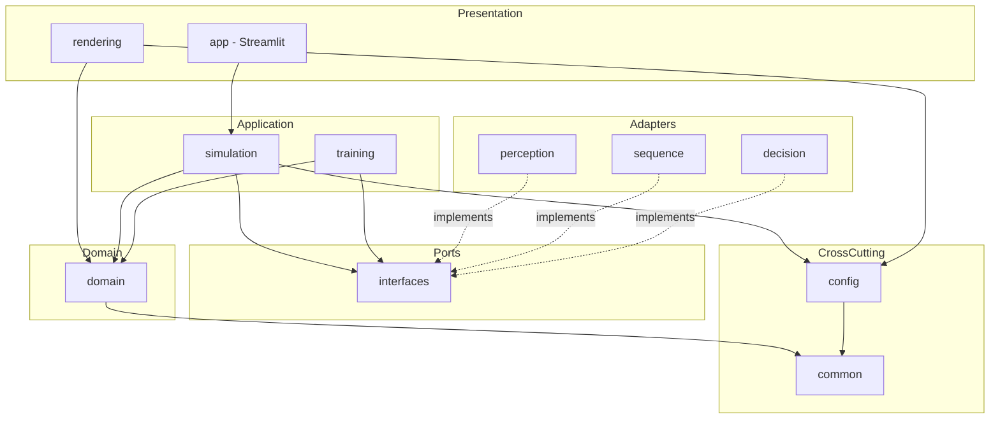
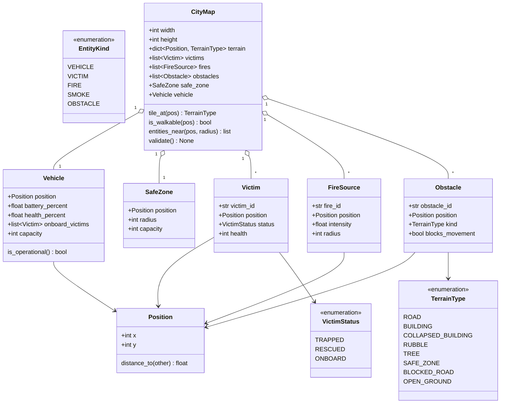
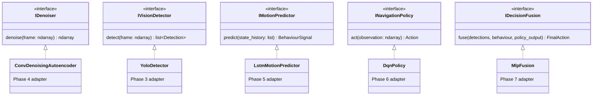
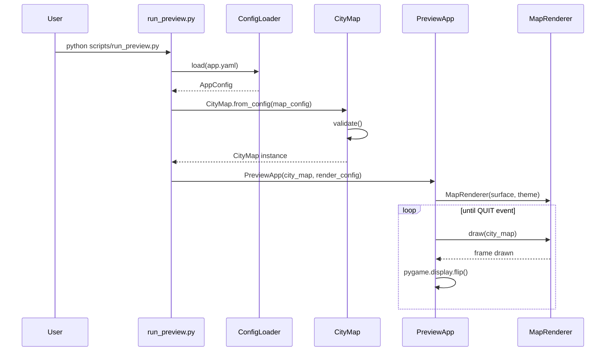
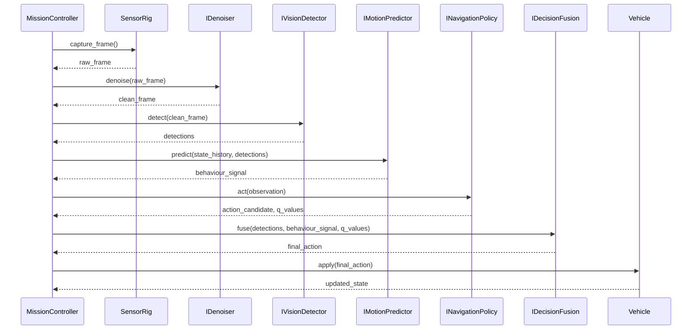
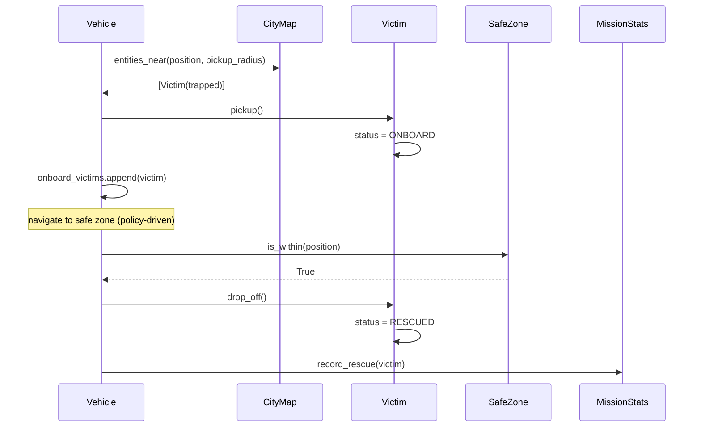

# SENTRY AI — Autonomous Emergency Rescue Vehicle for Disaster Zones

**Type:** Semester-long Applied Deep Learning project (simulation-based)
**Status:** Phases 1-8 complete, Phase 9 core complete — M1-M8 met (see §10-11)
**Audience:** Single student developer, evaluated to production-software standards

This document is the canonical architecture reference for SENTRY AI. It is intentionally
implementation-agnostic (no code) and describes *what* the system is, *how* its parts
communicate, and *when* each piece gets built. Individual phases may add phase-specific
notes under `docs/`, but this file is the source of truth for structure and contracts.

---

## Table of Contents

1. [Executive Summary](#1-executive-summary)
2. [Architectural Style](#2-architectural-style)
3. [High-Level Component Design](#3-high-level-component-design)
4. [Folder Structure](#4-folder-structure)
5. [Module Responsibilities](#5-module-responsibilities)
6. [Data Flow](#6-data-flow)
7. [UML — Package / Component Diagram](#7-uml--package--component-diagram)
8. [Class Diagrams](#8-class-diagrams)
9. [Sequence Diagrams](#9-sequence-diagrams)
10. [Development Roadmap & Phase Breakdown](#10-development-roadmap--phase-breakdown)
11. [Milestones](#11-milestones)
12. [API Contracts Between Modules](#12-api-contracts-between-modules)
13. [Configuration Files](#13-configuration-files)
14. [Training Pipeline](#14-training-pipeline)
15. [Deployment Pipeline](#15-deployment-pipeline)
16. [Testing Strategy](#16-testing-strategy)
17. [Documentation Structure](#17-documentation-structure)
18. [Future Improvements](#18-future-improvements)

---

## 1. Executive Summary

SENTRY AI is a simulated autonomous rescue vehicle that operates in a top-down disaster
city. It perceives its environment through a simulated camera, cleans that signal,
detects victims/fire/obstacles, predicts short-term motion behaviour, chooses navigation
actions via a learned policy, fuses all signals into a final decision, and acts —
rescuing victims and returning them to a safe zone before its battery or the mission
timer runs out.

Every syllabus unit maps to exactly one concrete, load-bearing module — not a bolted-on
demo:

| Unit | Concept | Role in the system |
|---|---|---|
| I | PyTorch MLP, Adam, ReLU, Dropout | Final decision-fusion network combining perception, sequence, and policy signals into an action/priority score |
| II | YOLOv8n, transfer learning | Detects victims, fire, obstacles in camera frames |
| III | LSTM | Predicts near-term vehicle motion / navigation behaviour class from state history |
| IV | Denoising Autoencoder | Cleans noisy/occluded camera frames before detection |
| V | Deep Q-Network (SB3) | Learns the *local* navigation policy — obstacle avoidance, waiting, rerouting — inside a Gymnasium environment |

Global routing is deliberately **not** learned: A* over an occupancy grid handles
city-scale pathfinding, and the DQN handles per-tick execution. See
[ADR 0002](docs/adr/0002-two-tier-navigation-and-command-center.md).

The system is built as a **walking skeleton first**: every phase produces a runnable,
tested increment. AI modules are introduced behind stable interfaces so the simulation
and rendering layers never depend on a specific model implementation — a trained
`DqnLocalController` replaces the deterministic `WaypointFollower` without touching
simulation code.

---

## 2. Architectural Style

**Clean Architecture / Ports & Adapters (Hexagonal)**, with a thin vertical AI-pipeline
running through it.

```
┌─────────────────────────────────────────────────────────────┐
│  Presentation  (rendering/, app/ — Pygame HUD, Streamlit)    │
├─────────────────────────────────────────────────────────────┤
│  Application   (simulation/, training/ — orchestration,      │
│                 mission control, RL environment)             │
├─────────────────────────────────────────────────────────────┤
│  Domain        (domain/ — entities, map, rules; zero deps    │
│                 on frameworks, pure Python + dataclasses)    │
├─────────────────────────────────────────────────────────────┤
│  Ports         (interfaces/ — abstract contracts: vision,    │
│                 denoiser, sequence, route planner, local     │
│                 controller, fusion)                          │
├─────────────────────────────────────────────────────────────┤
│  Adapters      (navigation/, perception/, sequence/,         │
│                 decision/ — A* plus the concrete PyTorch /   │
│                 YOLO / SB3 implementations of the ports)     │
└─────────────────────────────────────────────────────────────┘
```

Rules enforced project-wide:

- **Dependency rule**: dependencies point inward. `domain/` imports nothing from
  `simulation/`, `rendering/`, or any AI package. AI adapters depend on `interfaces/`
  and `domain/`, never the reverse.
- **Dependency inversion**: `simulation/` depends on `interfaces.IVisionDetector` etc.,
  not on `perception.YoloDetector`. Concrete adapters are wired in at composition roots
  (`scripts/*.py`, `app/`) via constructor injection — never imported ad hoc deep inside
  business logic.
- **Config-driven, no magic numbers**: every tunable (grid size, battery drain rate,
  reward weights, model hyperparameters) lives in `configs/*.yaml`, loaded into typed
  dataclasses.
- **Composition over inheritance**: entities and services favor small composed
  dataclasses/protocols over deep class hierarchies.

---

## 3. High-Level Component Design

```
                        ┌────────────────────┐
                        │   Streamlit App     │  (Phase 9)
                        │  mission dashboard   │
                        └─────────┬───────────┘
                                  │ reads mission logs / replay
┌─────────────────────────────────────────────────────────────────┐
│                        Simulation Engine (Phase 2)                │
│  ┌───────────┐  ┌────────────┐  ┌───────────────┐  ┌──────────┐  │
│  │ CityMap   │  │ MissionCtl │  │ SensorRig       │  │ Renderer │  │
│  │ (domain)  │  │ + A* / grid│  │ (frame capture) │  │ + HUD    │  │
│  └───────────┘  └─────┬──────┘  └───────┬────────┘  └──────────┘  │
└────────────────────────┼────────────────┼──────────────────────────┘
                          │                │ raw frame
                          │                ▼
                          │      ┌───────────────────┐
                          │      │ IDenoiser (Ph.4)   │
                          │      └─────────┬──────────┘
                          │                │ clean frame
                          │                ▼
                          │      ┌───────────────────┐
                          │      │ IVisionDetector    │ (Ph.3)
                          │      │ (YOLOv8n)          │
                          │      └─────────┬──────────┘
                          │                │ detections
                          │                ▼
                          │      ┌───────────────────┐
                          │      │ IMotionPredictor   │ (Ph.5)
                          │      │ (LSTM)             │
                          │      └─────────┬──────────┘
                          │                │ behaviour signal
                          │                ▼
                          │      ┌───────────────────┐
                          │      │ ILocalController   │ (Ph.6)
                          │      │ (DQN via SB3)       │
                          │      └─────────┬──────────┘
                          │                │ candidate action / Q-values
                          │                ▼
                          │      ┌───────────────────┐
                          └─────▶│ IDecisionFusion     │ (Ph.7)
                                 │ (MLP)                │
                                 └─────────┬────────────┘
                                           │ final action
                                           ▼
                                 ┌───────────────────┐
                                 │ Vehicle Actuation   │
                                 │ (simulation/)       │
                                 └───────────────────┘
```

Everything below the `IDenoiser → … → IDecisionFusion` chain is defined as a **port**
in Phase 1 and remains an interface (unimplemented adapter) until its dedicated phase.
The simulation engine can always run — with a scripted/manual policy standing in for
the learned one — because it only ever talks to the interface.

---

## 4. Folder Structure

```
sentry/
├── PROJECT.md                     # this document
├── README.md                      # quick start
├── pyproject.toml                 # packaging + tool config (pytest/mypy/ruff)
├── requirements.txt                # pinned core dependencies
├── requirements-ml.txt             # heavy ML deps, installed from Phase 3 onward
├── .gitignore
│
├── configs/                        # all tunables — nothing hardcoded in code
│   ├── app.yaml                    # root config: composes the others
│   ├── logging.yaml                # dictConfig-style logging setup
│   ├── simulation.yaml             # tick rate, mission rules, planner, hazards
│   ├── simulation_stress.yaml      # harsher hazards, robustness evaluation only
│   ├── vehicle.yaml                # vehicle kinematics/limits
│   ├── sensors.yaml                # camera layout, degradation, sensor palette
│   ├── sensors_v75.yaml            # camera experiment (bigger markers), Phase 3.1
│   ├── render.yaml                 # window size, palette, tile size
│   ├── maps/
│   │   └── city_default.yaml       # disaster city map definition
│   └── training/                   # per-model hyperparameters (Phase 3-7)
│       ├── yolo.yaml               # Phase 3
│       ├── autoencoder.yaml        # Phase 4
│       ├── lstm.yaml
│       ├── dqn.yaml
│       └── mlp_fusion.yaml
│
├── src/
│   └── sentry_ai/
│       ├── __init__.py
│       ├── common/                 # cross-cutting, framework-free
│       │   ├── logging_config.py
│       │   ├── exceptions.py
│       │   ├── color.py            # RGB value object, shared by renderer + sensors
│       │   └── types.py
│       ├── config/                 # typed config schema + loader
│       │   ├── schema.py
│       │   └── loader.py
│       ├── domain/                 # pure business entities & rules
│       │   ├── enums.py
│       │   ├── entities.py
│       │   ├── map.py
│       │   └── occupancy.py        # OccupancyGrid + the 0-6 code contract
│       ├── interfaces/             # ports — ABCs implemented by AI adapters
│       │   ├── perception.py       # IVisionDetector, IDenoiser
│       │   ├── sequence.py         # IMotionPredictor
│       │   ├── navigation.py       # IRoutePlanner, ILocalController
│       │   ├── world.py            # IWorldProcess, WorldChange, IOccupancyGridSource
│       │   └── decision.py         # IDecisionFusion
│       ├── navigation/             # global routing adapters (classical, not learned)
│       │   └── astar.py            # AStarPlanner
│       ├── rendering/              # Pygame presentation layer
│       │   ├── theme.py
│       │   ├── glyphs.py           # procedural entity shapes (no asset files)
│       │   ├── map_renderer.py
│       │   ├── grid_overlay.py     # the occupancy-grid debug view (G)
│       │   ├── camera_panel.py     # live camera strip (C)
│       │   ├── hud.py
│       │   ├── keyboard.py         # KeyboardController (manual driving)
│       │   ├── simulation_app.py   # live mission window
│       │   └── app.py              # static preview window
│       ├── simulation/             # Phase 2 — engine, mission, physics, hazards
│       │   ├── engine.py
│       │   ├── factory.py          # composes a mission; shared by every entry point
│       │   ├── grid_source.py      # GroundTruthGridSource — the answer key
│       │   ├── mission.py
│       │   ├── hazards.py          # fire spread + debris collapse
│       │   ├── events.py           # bounded mission event log
│       │   ├── vehicle_controller.py
│       │   └── waypoint_follower.py
│       ├── sensors/                # Phase 2 — synthetic cameras + ground truth
│       │   ├── camera.py           # CameraView, OnboardCamera, projection
│       │   ├── frame.py            # CameraFrame, YOLO label export
│       │   ├── palette.py          # what the cameras see (NOT the operator theme)
│       │   ├── rasterizer.py       # city -> RGB array + Detection labels
│       │   ├── degradation.py      # smoke/blur/noise -> Unit IV training pairs
│       │   └── rig.py              # SensorRig: CCTV network + onboard camera
│       ├── perception/             # Phase 3/4 — YOLO + autoencoder adapters
│       │   ├── yolo_detector.py    # YoloDetector implementing IVisionDetector
│       │   ├── merger.py           # DetectionMerger — four cameras, one belief (3.2)
│       │   ├── grid_builder.py     # OccupancyGridBuilder — belief -> grid (3.3)
│       │   ├── grid_metrics.py     # GridComparison — scores a belief grid (3.3)
│       │   ├── grid_source.py      # DetectedGridSource — the camera pipeline (3.4)
│       │   └── autoencoder.py      # ConvDenoisingAutoencoder implementing IDenoiser (4)
│       ├── sequence/                # Phase 5 — LSTM adapter
│       │   ├── behaviour.py        # what ADVANCE/RETREAT/HOLD/DIVERT mean + baseline
│       │   └── lstm_predictor.py   # LstmMotionPredictor implementing IMotionPredictor
│       ├── decision/                 # Phase 6/7 — DQN policy + MLP fusion adapters
│       │   └── dqn_controller.py   # egocentric features + DqnLocalController (6)
│       ├── training/                  # Phase 3-7 — training pipeline orchestration
│       │   ├── dataset.py          # builds the YOLO dataset from seeded missions
│       │   ├── yolo.py             # fine-tuning + per-class evaluation
│       │   ├── seed.py             # one call seeds random/numpy/torch
│       │   ├── metrics.py          # CSV metric log, one row per epoch
│       │   ├── checkpoint.py       # weights + metadata.json, saved together
│       │   ├── denoising.py        # autoencoder dataset, training, PSNR evaluation
│       │   ├── trajectories.py     # records vehicle states across seeded missions
│       │   ├── motion.py           # LSTM windows, baselines, macro-F1 report, trainer
│       │   ├── missions.py         # MissionFactory: missions by seed, random starts
│       │   ├── sentry_env.py       # SentryEnv: a whole mission as a Gymnasium env
│       │   └── dqn.py              # DQN trainer + mission-level comparison (M6)
│       └── app/                        # Phase 9 — Streamlit dashboard
│
├── scripts/                        # composition roots / CLI entry points
│   ├── run_preview.py              # Phase 1: render static city map
│   ├── run_simulation.py           # Phase 2: run a live/headless rescue mission
│   ├── capture_dataset.py          # Phase 2: capture one mission's frames + labels
│   ├── build_dataset.py            # Phase 3: write the synthetic perception dataset
│   ├── fetch_pretrained.py         # Phase 3: download transfer-learning checkpoints
│   ├── train_yolo.py               # Phase 3
│   ├── evaluate_yolo.py            # Phase 3: per-class detector metrics
│   ├── evaluate_grid.py            # Phase 3: score the detector-built occupancy grid
│   ├── train_autoencoder.py        # Phase 4
│   ├── evaluate_denoiser.py        # Phase 4: PSNR and detection with/without it
│   ├── build_denoised_dataset.py   # Phase 4: dataset for a detector behind the denoiser
│   ├── record_trajectories.py      # Phase 5: vehicle trajectories, split by mission
│   ├── train_lstm.py               # Phase 5
│   ├── evaluate_lstm.py            # Phase 5: vs baselines, all and novel windows
│   ├── train_dqn.py                # Phase 6
│   ├── evaluate_dqn.py             # Phase 6: vs the waypoint follower (M6)
│   ├── train_mlp_fusion.py         # Phase 7
│   └── run_app.py                  # Phase 9
│
├── data/
│   ├── raw/
│   ├── processed/
│   └── maps/
├── models/                         # trained artifacts (git-ignored, versioned via DVC/hash later)
├── tests/
│   ├── unit/
│   ├── integration/
│   └── e2e/
├── docs/
│   ├── architecture/                # phase-specific design notes, ADRs
│   ├── api/
│   └── adr/
└── notebooks/                       # exploratory training notebooks
```

Every package listed but not yet implemented is a **planned location**, not a stub —
it is created with real content only in the phase that owns it. There is no
placeholder code: an empty module that exists "for later" is a claim the codebase
cannot back up.

---

## 5. Module Responsibilities

| Module | Owns | Must NOT do |
|---|---|---|
| `common/` | Logging setup, exception hierarchy, shared type aliases | Import from domain/simulation/AI packages |
| `config/` | Loading & validating YAML into typed dataclasses | Contain business logic |
| `domain/` | Entities (Vehicle, Victim, Fire, Obstacle, Building, SafeZone…), the `CityMap` aggregate, domain enums | Know about Pygame, PyTorch, files on disk |
| `interfaces/` | Abstract contracts (ports) every AI adapter must satisfy | Contain any model logic |
| `rendering/` | Drawing domain state to a Pygame surface, HUD | Mutate domain/simulation state |
| `simulation/` (Ph.2) | Tick loop, mission state machine, vehicle physics, hazard processes | Know about specific model classes — only interfaces; import Pygame |
| `sensors/` (Ph.2) | Camera geometry, rasterizing the city to labelled RGB frames, frame degradation | Import Pygame or any model; decide anything about the mission |
| `navigation/` (Ph.2) | `AStarPlanner` — global routing over the occupancy grid | Learn anything, or decide per-tick actions |
| `perception/` (Ph.3/4) | `YoloDetector`, `ConvDenoisingAutoencoder` adapters implementing the perception ports | Drive the render loop or own domain entities |
| `sequence/` (Ph.5) | `LstmMotionPredictor` adapter | — |
| `decision/` (Ph.6/7) | `DqnLocalController`, `MlpFusion` adapters | Plan city-scale routes — that is `navigation/`'s job |
| `training/` (Ph.3-7) | Dataset assembly, training loops, checkpointing, metrics logging | Contain inference-time orchestration |
| `app/` (Ph.9) | Streamlit dashboard reading mission logs/replays | Run training or the live sim loop |

---

## 6. Data Flow

**Per simulation tick (from Phase 2 onward), the full autonomous pipeline:**

```
CityMap + Vehicle state
        │
        ▼
SensorRig.capture_all() ────────────────► CameraFrame[] {pixels (H,W,3), annotations}
        │                                  (FrameDegrader adds smoke/blur/noise)
        ▼
                                        raw_frame: np.ndarray (H,W,3)
        │
        ▼
IDenoiser.denoise(raw_frame) ───────────► clean_frame
        │
        ▼
IVisionDetector.detect(clean_frame) ────► Detection[] {label, bbox, confidence}
        │
        ▼
CameraFrame.world_position_of(d) ───────► Position   [image space -> map space]
        │
        ▼
IMotionPredictor.predict(state_history, Detection[]) ─► BehaviourSignal
        │
        ▼
ILocalController.decide(observation) ───► LocalDecision {action, q_values}
        │       (the route it follows comes from IRoutePlanner — see below)
        ▼
IDecisionFusion.fuse(SceneEvidence, BehaviourSignal, LocalDecision) ─► FinalAction
        │       (SceneEvidence: onboard detections projected egocentrically — ADR 0003)
        │
        ▼
VehicleController.apply(FinalAction) ───► updates Vehicle, Battery, Health
        │
        ▼
MissionController.update() ─────────────► pickups, deliveries, replans, timer
        │
        ▼
Renderer.draw(CityMap, Vehicle, HUD state) ─► frame on screen
```

**Global routing runs on its own cadence**, not once per tick — the command center
replans only when a route is finished, obstructed, or invalidated:

```
IOccupancyGridSource.grid_for()   ground truth: OccupancyGrid.from_city_map()
        │                        perception:   SensorRig -> FrameDegrader -> [IDenoiser]
        │                                      -> IVisionDetector -> DetectionMerger
        │                                      -> OccupancyGridBuilder
        │
        ▼
IRoutePlanner.plan(grid, start, goal) ──► Route {waypoints, cost}   [A*, not learned]
        │
        ▼
MissionController.next_waypoint() ─────► fed into every LocalObservation
```

**Hazards run before the vehicle observes**, so it always reacts to the world as it is
now rather than as it was:

```
IWorldProcess.advance(city_map, dt) ────► WorldChange {changed_tiles, description}
        │
        ▼
MissionController.refresh_grid() ───────► belief map rebuilt immediately
        │
        ▼
MissionController.invalidate_route_if_affected(changed_tiles) ──► replan if cut
```

**What exists today (Phases 3-5)** is that global loop,
the tick loop with a deterministic `WaypointFollower` — or, with `--dqn`, the Phase 6
`DqnLocalController` — as `ILocalController`, the hazard processes, and the sensor rig. With `--perception`
the command center's map is built from the cameras: frames are degraded, optionally
denoised by the Phase 4 autoencoder, run through YOLOv8n, merged across the four
overlapping CCTV views, and turned into the occupancy grid A\* plans over.
With `--full` (Phase 8) every model runs live: `FusedLocalController` feeds the
DQN's Q-values, the LSTM's behaviour signal and the onboard camera's `SceneEvidence`
to the Phase 7 `MlpFusion`, whose action the vehicle executes. The command center's
map can lag the world (`LaggedGridSource`); what the onboard camera sees when fusion
overrides is reported back to that map (`OnboardHazardReporter`).

---

## 7. UML — Package / Component Diagram



---

## 8. Class Diagrams

### 8.1 Domain entities (Phase 1)



### 8.2 Ports (interfaces — defined Phase 1, implemented in later phases)



---

## 9. Sequence Diagrams

### 9.1 Phase 1 — Static map preview (implemented)



### 9.2 Future — Autonomous mission tick (Phase 8 target, shown for context)



### 9.3 Future — Victim rescue interaction (Phase 2/8 target)



---

## 10. Development Roadmap & Phase Breakdown

| Phase | Title | Weeks | Syllabus Unit(s) | Status |
|---|---|---|---|---|
| 1 | Foundation & Core Architecture | 1-2 | — (infra) | ✅ **Complete** |
| 2 | Simulation Engine, Occupancy Grid & A* Routing | 3-4 | — (infra) | ✅ **Complete** |
| 3 | Computer Vision — Detection | 5-6 | Unit II | ✅ **Complete** |
| 4 | Representation Learning — Denoising AE | 7 | Unit IV | ✅ **Complete** |
| 5 | Sequence Modeling — LSTM | 8 | Unit III | ✅ **Core complete** — consumed from Phase 7 |
| 6 | Reinforcement Learning — DQN | 9-11 | Unit V | ✅ **Core complete** — perceived-grid test in Phase 8 |
| 7 | Decision Fusion — MLP | 12 | Unit I | ✅ **Complete** |
| 8 | End-to-End Autonomous Integration | 13 | All | ✅ **Complete** |
| 9 | Dashboard, Testing, Docs, Deployment | 14-15 | — | ✅ **Core complete** — no CI/packaging |
| 10 | Stretch / Future Improvements | post-semester | — | ⏳ Not started |

### Phase 1 — Foundation & Core Architecture ✅

Scope: everything needed to *compile, render a static disaster city, and pass tests* —
with zero AI, zero movement, zero mission logic. This is the walking skeleton.

Deliverables:
- Repo scaffolding: `pyproject.toml`, `requirements.txt`, `.gitignore`, tool config (pytest/mypy/ruff)
- Structured logging (`common/logging_config.py`, `configs/logging.yaml`)
- Exception hierarchy (`common/exceptions.py`)
- Config system: typed dataclasses + YAML loader with validation (`config/`)
- Domain layer: entities, enums, `CityMap` aggregate with validation (`domain/`)
- Default disaster-city map definition (`configs/maps/city_default.yaml`)
- AI ports defined as ABCs with zero logic (`interfaces/`)
- Static Pygame(-ce) renderer + preview script (`rendering/`, `scripts/run_preview.py`)
- Unit tests for config, domain, map loading (`tests/unit/`)

Explicitly **out of scope** for Phase 1: vehicle movement, battery/timer countdown,
fire spread, sensors, HUD, any PyTorch/YOLO/RL code. These belong to Phases 2-7.

### Phase 2 — Simulation Engine, Occupancy Grid & A* Routing ✅

Architecture note: this phase split navigation into a global (A*) and a local (DQN)
tier — see [ADR 0002](docs/adr/0002-two-tier-navigation-and-command-center.md),
[`docs/architecture/phase2-simulation.md`](docs/architecture/phase2-simulation.md), and
[`docs/architecture/phase2-dynamic-world-and-sensors.md`](docs/architecture/phase2-dynamic-world-and-sensors.md).

Mission loop:
- Tick-based `SimulationEngine` (fixed timestep, decoupled from frame rate)
- `OccupancyGrid` with the specification's 0-6 codes, built from the city
- `AStarPlanner` — risk-aware global routing over that grid
- `MissionController` state machine: objective selection, pickups, deliveries,
  replanning, unreachable-objective handling, success/failure adjudication
- `VehicleController`: egocentric movement, collision, battery drain, fire damage
- `WaypointFollower` — the deterministic `ILocalController` baseline the DQN must beat
- HUD (phase, waypoint, stats, battery/health gauges) and route overlay
- Manual keyboard driving through the same action space and physics
- `scripts/run_simulation.py`, windowed and `--headless`

Dynamic world:
- `IWorldProcess` / `WorldChange` — the port for anything that changes the city
  without the vehicle touching it
- `FireSpreadProcess` — a seeded cellular automaton: fire grows, creeps through fuel,
  and burns out. Restricted to flammable terrain, so it threatens victims and raises
  route costs without ever severing the road network
- `DebrisCollapseProcess` — the specification's dynamic obstacle, dropping debris into
  streets beside standing buildings and forcing mid-mission replans
- `MissionController.invalidate_route_if_affected` — the command center reacts only
  when a change lands on the part of the route it has not driven yet

Sensors (`sensors/`):
- `CameraView` / `OnboardCamera` — camera footprints and the exact pixel↔tile
  projection that turns a detection back into a map coordinate
- `FrameRasterizer` — the city painted into RGB arrays *with ground-truth
  `Detection` labels produced in the same pass*, so image and truth cannot diverge
- `FrameDegrader` — smoke, blur, and sensor noise, producing the aligned
  (corrupted, clean) pairs Unit IV's autoencoder trains on
- `SensorRig` — the four-camera CCTV network plus the vehicle's onboard view
- `scripts/capture_dataset.py` — writes images, YOLO labels, and clean pairs across a
  whole mission

Not built, and deliberately so: weather, which the specification lists as optional.

### Phase 3 — Computer Vision (Unit II) ✅

Design notes and the full experiment log:
[`docs/architecture/phase3-detection.md`](docs/architecture/phase3-detection.md).

Outcome, measured on missions the detector saw no frame of:

| | result |
|---|---|
| Detector (`labelfix` weights) | mAP50 **0.991**, victim recall **1.000** |
| Grid built from YOLO output | identical to `from_city_map` on the shipped map, cell for cell |
| Missions on perception, six hazard seeds | 4 rescued, 0 lost, 0 unreachable — same as ground truth |

The dataset already exists: `scripts/capture_dataset.py` emits degraded frames, their
clean counterparts, and YOLO label files, with class ids fixed by
`sensors.frame.YOLO_CLASSES`.

**Detector classes are `victim`, `fire`, `obstacle` — and nothing else.** Roads and
buildings are painted into every frame but never annotated. The simulator generated
the static layout, so training a detector to rediscover it would add parameters and
label noise while teaching the system nothing it does not already know. The occupancy
grid keeps taking terrain from the map and only the *dynamic* codes (`FIRE`, `DEBRIS`,
`VICTIM`) from detections. If a later phase ever needs to run on real camera input
with no map, that is a new decision recorded in a new ADR, not a quiet reversal here.

Phase 3 is deliberately built in five steps, each independently testable, because the
value of the split is that **the detector never learns anything about maps**:

**3.1 — Detect.** `train_yolo.py` + `configs/training/yolo.yaml` fine-tune YOLOv8n.
`YoloDetector` implements `IVisionDetector`: image in, `Detection[]` out. It does not
know what a `Position` is. Success is mAP on a held-out split of the captured dataset.

**3.2 — Merge.** A `DetectionMerger` takes the four CCTV frames' detections, projects
each through `CameraFrame.world_position_of`, and answers the question the overlapping
footprints force: *are these two boxes the same victim seen twice, or two victims?*
Testable on its own with hand-built detections and no model in the loop.

**3.3 — Build the map.** An `OccupancyGridBuilder` turns merged world-space detections
into an `OccupancyGrid`, replacing `OccupancyGrid.from_city_map` as the producer.
Scored against that ground-truth grid, which stays in the codebase precisely so the
detector-driven grid has something to be measured against.

**3.4 and 3.5 — already built, and that is the point.** `AStarPlanner`,
`MissionController`, and `VehicleController` are unchanged Phase 2 code. Swapping the
grid's producer must not touch a line of them; if it does, the seam ADR 0002 describes
has been broken. The Phase 3 deliverable here is an integration test proving a full
mission runs on a detector-derived grid, not new navigation code.

Note on ordering: the degrader already sits between the camera and the dataset, so
Phase 4's autoencoder slots in as `SensorRig → FrameDegrader → IDenoiser →
IVisionDetector` without moving anything. Until Phase 4 exists, 3.1 trains directly on
degraded frames, which is the honest baseline the denoiser has to beat.

### Phase 4 — Representation Learning (Unit IV) ✅

Design notes: [`docs/architecture/phase4-denoising.md`](docs/architecture/phase4-denoising.md).

Training pairs already exist: `FrameDegrader.degrade_pair` returns a corrupted frame
and its pixel-aligned clean original.

- Convolutional Denoising Autoencoder (PyTorch) trained to reconstruct clean frames
  (`perception/autoencoder.py`, `training/denoising.py`, `scripts/train_autoencoder.py`)
- `ConvDenoisingAutoencoder` adapter implementing `IDenoiser`, inserted upstream of the
  detector: `SensorRig → FrameDegrader → IDenoiser → IVisionDetector`
- Shared training infrastructure every later phase reuses: `training/seed.py`,
  `training/metrics.py`, `training/checkpoint.py`
- `scripts/evaluate_denoiser.py` — reconstruction PSNR and, given detector weights,
  mAP with and without the denoiser at increasing corruption: the M4 measurement
- `scripts/build_denoised_dataset.py` — the detector behind the denoiser must be
  trained on denoised frames; the smoky-trained one gets *worse* when handed them

Outcome (full length on the target RTX 3050 GPU, held-out missions):

| | result |
|---|---|
| Denoiser + smoky-trained detector (CPU run) | worse everywhere — victim recall 0.35 at 1.0x |
| Denoiser + detector trained on denoised frames, at 2x corruption | mAP50 0.880 → **0.938**, victim recall 0.861 → **0.990** |
| Same, at 0 / 1.0 / 1.5x | equal or better at every level |
| Missions on the denoised pipeline, six hazard seeds | 4 rescued, 0 lost on every seed — same as ground truth |

### Phase 5 — Sequence Modeling (Unit III) ✅

Design notes: [`docs/architecture/phase5-sequence.md`](docs/architecture/phase5-sequence.md).

- Trajectory dataset: 200 seeded missions, each from a random road tile, split by
  mission (`scripts/record_trajectories.py`)
- `sequence/behaviour.py` defines the four classes egocentrically — HOLD, or net
  movement within 30 degrees ahead (ADVANCE), behind (RETREAT), or neither (DIVERT)
  over the next 4 ticks. The same rule labels the data and runs the baseline
- 2-layer LSTM (52k parameters) over 8 ticks of 7 features;
  `LstmMotionPredictor` implements `IMotionPredictor` and also exposes the full
  class distribution for Phase 7
- Scored by macro-F1 against "always advance" and "keep doing the same", on all
  held-out windows *and* on only the ones never seen in training

Outcome (CPU, ~1 minute):

| held-out windows | best baseline macro-F1 | LSTM macro-F1 | LSTM accuracy |
|---|---|---|---|
| all (7,279) | 0.205 | **0.802** | 0.942 |
| novel only (178) | 0.349 | **0.663** | 0.820 |

A first run scored 0.964 — until 99.4% of held-out windows proved to be copies of
training windows (one start tile, one route). Randomised starts and the novel-window
score are the correction; the design notes record it.

### Phase 6 — Reinforcement Learning (Unit V) ✅

Design notes: [`docs/architecture/phase6-reinforcement.md`](docs/architecture/phase6-reinforcement.md).

- `SentryEnv` (`training/sentry_env.py`): one episode is one real mission — hazards,
  A\* replanning, the live physics — with the agent in place of the waypoint follower
- Reward is **local** (ADR 0002), every weight in `configs/training/dqn.yaml`: progress
  toward the planned waypoint, pickups, deliveries, and penalties for collisions,
  damage, fire, time, battery and reversing
- Stable-Baselines3 DQN over seven **egocentric** features (no absolute position);
  `DqnLocalController` implements `ILocalController` and drops in with
  `run_simulation.py --dqn`
- The checkpoint is chosen, and M6 judged, on **real held-out missions** against the
  follower — never on episode return

Outcome (CPU, 300k steps, ~16 min; 40 held-out missions, identical for both drivers):

| | rescued | lost | collisions | completed |
|---|---|---|---|---|
| waypoint follower | 143 | 5 | 0 | 95% |
| DQN | **149** | 5 | 0 | **100%** |
| harsh disaster: follower / DQN | 135 / **136** | 14 / 13 | 0 / 0 | 98% / 98% |

Honestly: **parity with a speed edge.** The extra rescues are one situation — the DQN
reversed out where the follower U-turned, was two tiles further on when a fire sealed
the street, and escaped. An early policy drove 14% of its tiles backwards; a reverse
penalty fixed that. With a ground-truth grid the planner absorbs every surprise, so the
local tier's real test is on the camera-built grid in Phase 8.

### Phase 7 — Decision Fusion (Unit I)

- MLP (PyTorch, Adam optimizer, ReLU activations, Dropout regularization) fusing
  detector confidences + LSTM behaviour signal + DQN Q-values into the vehicle's final
  action/priority decision
- `MlpFusion` adapter implementing `IDecisionFusion`

Done — design notes and results in
[`docs/architecture/phase7-fusion.md`](docs/architecture/phase7-fusion.md), the scenario
in [ADR 0003](docs/adr/0003-egocentric-scene-evidence-and-map-lag.md). Fusion is judged
where it has work to do: the command center's map lags the world by 3 s, and the
vehicle's own camera sees what the map does not.

### Phase 8 — End-to-End Autonomous Integration

- Composition root wires all five adapters into `MissionController`, replacing the
  manual-control stand-in
- Full autonomous mission runs; mission statistics logged
- Profiling against target hardware (RTX laptop GPU, 16GB RAM) — trim batch sizes /
  resolution as needed

Done as `run_simulation.py --full`: `FusedLocalController` puts DQN, LSTM, onboard
camera (degrader -> autoencoder -> YOLOv8n) and fusion behind the one `ILocalController`
port, so neither the engine nor `MissionController` changed. Runs live on an RTX 4060
laptop GPU.

### Phase 9 — Dashboard, Testing, Documentation & Deployment

- Streamlit dashboard: live/replay mission viewer, statistics, model registry view
- Full test pyramid, coverage target enforced in CI
- Packaging + deployment pipeline (see §15)
- Final docs, ADRs, demo script

Built instead of a Streamlit dashboard: an in-window **mission-control strip** (live
Q-values, LSTM behaviour, camera evidence, fusion decision, override and collision
counts) with **ablation keys** that switch each model off mid-mission — it shows *why*
each model matters, offline, in the same window. Also added: an **OpenStreetMap
importer** (`scripts/import_osm_map.py`, real streets as a disaster city), an
**isometric 3D view** (`V`), **satellite imagery** under imported maps (`S`,
`scripts/fetch_satellite.py`), **real street photos** from Mapillary beside mission control
(`P`, `scripts/fetch_street_photos.py`), and **`scripts/demo.py`**, the review running
order. All imagery is display only; the models see the simulated city. Not done: CI and
packaging.

### Phase 10 — Future Improvements (see §18)

---

## 11. Milestones

- [x] **M1 — Walking Skeleton**: `pytest` green, `scripts/run_preview.py` renders the
      default disaster city map end-to-end. *(Phase 1)*
- [x] **M2a — Living City**: vehicle moves under manual *and* autonomous control,
      battery/timer function, HUD renders live stats, A* routes across the city, a
      complete mission runs unattended. *(Phase 2)*
- [x] **M2b — Changing City**: fire spreads, obstacles appear mid-mission, and the
      command center replans around them; `SensorRig` emits camera frames. *(Phase 2)*
- [x] **M3a — Sees**: YOLOv8n detects victims/fire/obstacles in simulated camera frames
      above target mAP. *(Phase 3.1)*
- [x] **M3b — Sees Once**: detections from the four overlapping CCTV views merge into
      one world-space belief; a victim in two frames is one victim. *(Phase 3.2-3.3)*
- [x] **M3c — Drives On What It Sees**: a full mission completes on a detector-derived
      occupancy grid, with `navigation/` and `simulation/` unmodified. *(Phase 3.4-3.5)*
- [x] **M4 — Sees Clearly**: denoising autoencoder measurably improves detection mAP
      under injected noise. *(Phase 4 — at 2x corruption, mAP50 0.880 → 0.938 and victim
      recall 0.861 → 0.990, with a detector trained on denoised frames; full length on
      GPU. See [phase4-denoising.md](docs/architecture/phase4-denoising.md).)*
- [x] **M5 — Anticipates**: LSTM behaviour predictions beat a naive baseline on held-out
      trajectories. *(Phase 5 — macro-F1 0.802 vs 0.205 on all held-out windows, and
      0.663 vs 0.349 on windows never seen in training.)*
- [x] **M6 — Learns to Drive**: DQN agent reaches a defined rescue-rate threshold in
      `SentryEnv` without human control. *(Phase 6 — threshold: ≥90% of the waypoint
      follower's rescues on the same held-out missions; reached 104% (149 vs 143 of 40
      missions), parity under a harsher disaster. See
      [phase6-reinforcement.md](docs/architecture/phase6-reinforcement.md).)*
- [x] **M7 — Decides**: MLP fusion outperforms any single upstream signal on a fused
      decision-quality metric. *(Phase 7 — on held-out ticks fusion catches 89.5% of the
      stale-map DQN's mistakes while changing 1.4% of its correct choices; no single signal
      does both. On 40 whole missions it removes 87% of the lag-caused collisions. See
      [phase7-fusion.md](docs/architecture/phase7-fusion.md).)*
- [x] **M8 — Fully Autonomous**: a complete mission (spawn → rescue all reachable
      victims → return to safe zone) runs with zero human input. *(Phase 8 —
      `run_simulation.py --full`, all five models live.)*
- [ ] **M9 — Shippable**: dashboard, docs, and deployment pipeline complete; project
      demoable end-to-end from a clean checkout. *(Phase 9)*

---

## 12. API Contracts Between Modules

Contracts are expressed as Python `Protocol`/`ABC` signatures — the authoritative form
lives in `src/sentry_ai/interfaces/`. Types (`Detection`, `BehaviourSignal`, `Action`,
`FinalAction`) are frozen dataclasses defined alongside the interfaces they serve.

```python
# interfaces/perception.py
class IDenoiser(ABC):
    def denoise(self, frame: NDArray[np.uint8]) -> NDArray[np.uint8]: ...

class IVisionDetector(ABC):
    def detect(self, frame: NDArray[np.uint8]) -> list[Detection]: ...

# interfaces/sequence.py
class IMotionPredictor(ABC):
    def predict(self, state_history: Sequence[VehicleState]) -> BehaviourSignal: ...

# interfaces/world.py  — where the planner's map comes from (Phase 3.4)
class IOccupancyGridSource(ABC):
    def grid_for(self, city_map: CityMap, vehicle_position: Position) -> OccupancyGrid: ...

# interfaces/navigation.py  — two tiers, see ADR 0002
class IRoutePlanner(ABC):                      # global: A*, deterministic
    def plan(self, grid: OccupancyGridLike, start: Position, goal: Position) -> Route: ...

class ILocalController(ABC):                   # local: DQN (Phase 6)
    def decide(self, observation: LocalObservation) -> LocalDecision: ...

# interfaces/decision.py
class IDecisionFusion(ABC):
    def fuse(
        self,
        detections: list[Detection],
        behaviour: BehaviourSignal,
        local_decision: LocalDecision,
    ) -> FinalAction: ...
```

The vehicle's action space is **egocentric** — `MOVE_FORWARD`, `REVERSE`, `TURN_LEFT`,
`TURN_RIGHT`, `STOP` — so a learned policy generalizes across approach directions.
`LOCAL_ACTION_ORDER` fixes the index each action occupies in a network's output;
appending is safe, reordering invalidates every checkpoint.

Contract rules:

- Every adapter is **stateless per call** except for internal model weights — no adapter
  reaches back into `domain`/`simulation` state; everything it needs arrives as
  arguments, everything it produces is a plain dataclass return value.
- Adapters are constructed with an explicit config object (dependency injection) and are
  swappable at the composition root without touching `simulation/`.
- Interfaces are versioned by the module docstring, not by breaking signature changes —
  a signature change is itself an architectural change requiring an ADR.

---

## 13. Configuration Files

All configuration is YAML, loaded into typed, validated dataclasses (`config/schema.py`,
`config/loader.py`). No module reads a YAML file directly — everything goes through
`ConfigLoader`.

`configs/app.yaml` (root, composes the rest):

```yaml
logging_config: "configs/logging.yaml"
map_config: "configs/maps/city_default.yaml"
simulation_config: "configs/simulation.yaml"   # optional: preview-only configs omit it
vehicle_config: "configs/vehicle.yaml"         # optional: preview-only configs omit it
sensor_config: "configs/sensors.yaml"          # optional: only frame-capturing scripts read it
render:
  window_title: "SENTRY AI — Disaster City Preview"
  tile_size_px: 28
  target_fps: 60
  palette_config: "configs/render.yaml"
```

`configs/simulation.yaml` and `configs/vehicle.yaml` (Phase 2). Every key in both is
**optional** — an omitted key falls back to its dataclass default, so adding a tunable
never breaks an existing config file:

```yaml
# simulation.yaml
tick_rate_hz: 10.0            # fixed sim step, decoupled from render.target_fps
mission:
  time_limit_seconds: 300.0
  replan_on_blocked_route: true
  min_battery_to_continue: 15.0
planner:
  fire_risk_penalty: 6.0      # extra A* cost near known fire; 0.0 = pure shortest path
  fire_risk_radius: 2
  turn_penalty: 0.4
hazards:
  seed: 20250805              # fixed, so a mission replays identically
  fire:                       # cellular automaton; flammable terrain only
    enabled: true
    interval_seconds: 3.0     # much slower than the tick rate, on purpose
    growth_per_step: 0.12
    burnout_per_step: 0.18
    ignition_chance: 0.16
    max_radius: 3
    max_active_fires: 12
  debris:                     # the spec's dynamic obstacle
    enabled: true
    interval_seconds: 3.0
    collapse_chance: 0.5
    max_collapses: 6

# vehicle.yaml
capacity: 2
battery:
  initial_percent: 100.0
  drain_per_move: 0.35
  drain_per_turn: 0.10
  drain_per_idle_tick: 0.02
collision_damage_percent: 5.0
fire_damage_per_tick: 2.0
sensor_range_tiles: 5.0
```

`configs/sensors.yaml` (Phase 2). Two readers share this file, each owning one
section: `ConfigLoader.load_sensor_config()` takes the geometry and degradation,
`SensorPalette.from_config()` takes the palette — the same split `app.yaml` has with
`render.yaml`:

```yaml
tile_size_px: 16              # 16 px x 16x10-tile cameras = 256x160, both /32 for YOLO
cameras:                      # four fixed CCTV views, overlapping by two columns
  - {id: "cctv_nw", origin: [0, 0],  size: [16, 10]}
  - {id: "cctv_ne", origin: [14, 0], size: [16, 10]}
  - {id: "cctv_sw", origin: [0, 10],  size: [16, 10]}
  - {id: "cctv_se", origin: [14, 10], size: [16, 10]}
onboard:                      # square, odd-sized, follows the vehicle
  id: "onboard"
  span_tiles: 9
  tile_size_px: 16
degradation:                  # produces the (corrupted, clean) pairs Unit IV needs
  smoke_density: 0.45
  smoke_grey: 150
  blur_radius: 1
  noise_std: 8.0
palette:                      # what the DETECTOR sees — deliberately not render.yaml
  texture_jitter: 12
  terrain: {road: [70, 70, 74], building: [120, 116, 108], ...}
  fire_core: [255, 214, 96]
  fire_edge: [186, 66, 26]
  victim: [235, 96, 150]
```

`configs/maps/city_default.yaml` (excerpt — full file has the real 30x20 city):

Terrain is authored as an ASCII grid rather than per-category coordinate lists — far
more compact and visually verifiable for a real city layout than hand-writing hundreds
of `[x, y]` pairs (see `docs/architecture/phase1-foundation.md` for the rationale).
`grid` is `height` strings of `width` characters, resolved through a legend
(`.`=open ground, `#`=building, `=`=road, `x`=collapsed building, `r`=rubble, `t`=tree,
`!`=blocked road). `safe_zone` stays an explicit key rather than a grid glyph because it
carries extra metadata (radius, capacity) a single character can't express.

```yaml
width: 30
height: 20

grid:
  - "...=.####......=..####....=..."
  - "...=.####......=..####....=..."
  # ... 18 more rows ...

safe_zone:
  position: [1, 1]
  radius: 2
  capacity: 4
vehicle_start: [1, 3]
victims:
  - id: "victim_01"
    position: [10, 8]   # trapped under the collapsed building
fires:
  - id: "fire_01"
    position: [19, 7]
    intensity: 0.7
    radius: 2
```

Later-phase configs (`simulation.yaml`, `vehicle.yaml`, `configs/training/*.yaml`)
follow the same pattern: one YAML file per concern, one dataclass per YAML file,
validated on load, never read with bare `open()` outside `config/loader.py`.

---

## 14. Training Pipeline

Each learned component (Phases 3-7) follows the same orchestration shape, run via its
own `scripts/train_*.py`:

```
1. Load training config (configs/training/<model>.yaml) via ConfigLoader
2. Assemble/load dataset
     - Phase 3 (YOLO): synthetic frames + auto-generated labels from CityMap ground truth
     - Phase 4 (AE):   synthetic frames + injected noise, self-supervised (input=noisy, target=clean)
     - Phase 5 (LSTM): trajectory windows recorded from seeded missions, random starts
     - Phase 6 (DQN):  online rollouts inside SentryEnv (Gymnasium)
     - Phase 7 (MLP):  logged tuples of (detector_out, lstm_out, dqn_out) -> fused label/reward
3. Build model from config (architecture hyperparameters never hardcoded)
4. Train with checkpointing every N epochs/steps to models/<name>/checkpoints/
5. Evaluate against a held-out split / evaluation episodes
6. Log metrics (loss, mAP, reward curve, etc.) to a run directory under models/<name>/runs/
7. Export final artifact to models/<name>/best.pt (or SB3 .zip) with a metadata.json
   recording config hash, git commit, metrics — for reproducibility
```

Shared infrastructure (`training/`, built incrementally as each phase needs it):
- `training/checkpoint.py` — save/load with metadata
- `training/metrics.py` — simple CSV/JSON metric logger (kept dependency-light;
  TensorBoard/W&B considered only if hardware/time allows — see §18)
- `training/seed.py` — deterministic seeding across numpy/torch/random for reproducible runs

---

## 15. Deployment Pipeline

This is a simulation project running on a single developer laptop, so "deployment"
means *reproducible local execution*, with containerization as an optional stretch:

```
1. Clean checkout
2. python3 -m venv .venv && source .venv/bin/activate
3. pip install -r requirements.txt              # core + Phase 1/2 deps
4. pip install -r requirements-ml.txt            # heavy deps, Phase 3+
5. pytest                                        # must be green before running the app
6. python scripts/run_preview.py                 # Phase 1+ sanity check
7. python scripts/run_simulation.py              # Phase 2+ full sim
8. streamlit run scripts/run_app.py              # Phase 9 dashboard
```

Artifact packaging:
- Trained model weights live under `models/`, git-ignored, referenced by config path +
  content hash so a given commit's config always points at a reproducible artifact.
- `pyproject.toml` defines the installable package (`sentry_ai`) and console-script
  entry points once the CLI stabilizes (Phase 8/9).
- Optional stretch: a `Dockerfile` pinning CUDA/torch versions for grading-environment
  parity (§18) — not required for the core deliverable.

---

## 16. Testing Strategy

Pytest, three tiers, mirrored under `tests/`:

| Tier | Directory | Scope | Speed |
|---|---|---|---|
| Unit | `tests/unit/` | Single class/function in isolation (config parsing, entity validation, map bounds checks, a single adapter's `detect()` on a fixed input) | ms |
| Integration | `tests/integration/` | Multiple modules together without a display/GPU (e.g. `ConfigLoader` → `CityMap` → renderer draws without raising, `MissionController` tick against a fake policy) | fast, no I/O beyond fixtures |
| End-to-end | `tests/e2e/` | Full scripted mission run headless (`SDL_VIDEODRIVER=dummy`), asserting mission completion / stats | seconds |

Rules:
- Every module merged in a phase ships with unit tests for that phase in the same
  change — every feature has unit tests.
- Tests that need the ML stack (Torch, Ultralytics, OpenCV) skip cleanly when it is
  not installed, so the core suite runs on `requirements.txt` alone.
- AI adapters are tested against interface conformance (mock inputs of the right shape,
  correct output dataclass type/fields) — not against training-quality assertions
  (those live in the training pipeline's own evaluation step, §14).
- Rendering tests run with `SDL_VIDEODRIVER=dummy` so CI/headless environments don't
  need a display.
- `pytest-cov` tracks coverage; target ≥85% for `domain/` and `config/` (pure logic,
  should be near 100%), a lower bar for `rendering/` (I/O-heavy, visually verified too).

---

## 17. Documentation Structure

```
docs/
├── architecture/
│   ├── phase1-foundation.md     # design decisions specific to Phase 1
│   ├── phase2-simulation.md     # ... one per phase, added as that phase lands
│   ├── phase2-dynamic-world-and-sensors.md
│   ├── phase3-detection.md
│   ├── phase4-denoising.md
│   ├── phase5-sequence.md
│   └── phase6-reinforcement.md
├── adr/                          # Architecture Decision Records
│   ├── 0001-config-driven-yaml-dataclasses.md
│   └── 0002-two-tier-navigation-and-command-center.md
└── api/                          # generated or hand-written interface reference
```

`PROJECT.md` (this file) stays the single always-current architecture map; `docs/`
accumulates the historical *why* behind decisions (ADRs) and per-phase deep dives, so
the root document never becomes a changelog.

---

## 18. Future Improvements

Beyond the 9 core phases, tracked as backlog rather than committed scope:

- **Multi-agent coordination**: more than one rescue vehicle, shared mission planning.
- **Procedural map generation**: replace the static `city_default.yaml` with a
  generator producing varied disaster layouts for more robust RL training.
- **Vision-based DQN observation**: extend Phase 6's state-based policy to consume
  denoised camera frames directly, closing the loop fully through Phases 3-4.
- **Model compression**: quantization/pruning of YOLOv8n and the DQN policy for
  hypothetical edge deployment (ties back to the "avoid unnecessarily heavy models"
  hardware constraint).
- **Experiment tracking upgrade**: swap the lightweight CSV/JSON metric logger for
  TensorBoard or Weights & Biases if time/hardware allow.
- **Containerized reproducibility**: a `Dockerfile`/`devcontainer` pinning the exact
  CUDA/torch stack for grading-environment parity.
- **Sim-to-real considerations**: a written discussion (not implementation) of what
  would need to change to move from this simulation to a physical robot.

---

## Environment Notes (recorded for reproducibility)

- Target/dev interpreter: **Python 3.14** on the assigned machine, targeting an
  RTX 3050 Laptop GPU (4GB) — informs "prefer lightweight models" throughout (YOLOv8**n**,
  not larger variants; modest LSTM/MLP hidden sizes; DQN over heavier RL algorithms).
- `pygame` has no prebuilt wheel for CPython 3.14 at time of writing and fails to build
  from source without system SDL dev headers. The project uses **`pygame-ce`** (the
  actively maintained, drop-in-compatible community fork — `import pygame` unchanged)
  instead, which ships a cp314 wheel. `requirements.txt` documents this substitution.
